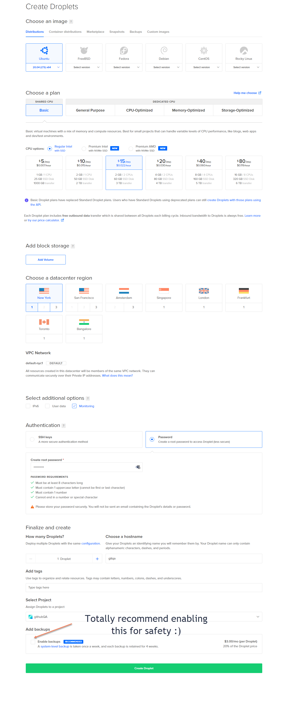
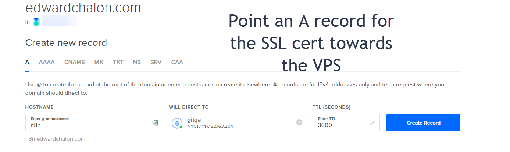
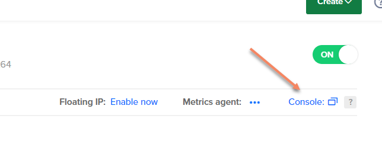

# N8N Auto Installer
## Save time with a self installer script :)

### Purpose

Hows N8N installed in less than 15 mins sound?

N8N is an amazing tool, it just has alot of parts to install on a vanilla VPS. Then theres also the fact that there are alot of ways to install it too. This way, sets up a brand new VPS
with everything needed for you :tada:

### Tested on

Digital Ocean - Cant imagine why it wouldnt work on Ubuntu 20.04 on AWS/ GCP/ Azure though.

### Whats it do?

This script will take a few parameters at the beginning of the script, and then:
1. Make sure Ubuntu is up to date
2. Install PostgreSQL
3. Install NodeJS 16
4. Install PM2, and Caddy along with N8N
5. Configure it to use PostgreSQL as the database, PM2 to run N8N (and restart it on VPS reboots too)
6. Authentication enabled for N8N
7. Lets Encrypt SSL for your server using Caddy and its auto renew

### Requirements

1. A VPS (Ubuntu 20.04 Server)
2. A domain name. An existing domain, with a subdomain pointing towards the VPS works too
3. Point the domain or subdomain towards your VPS
4. Run this script

### Steps
1. Log into your Digital Ocean account, and make a VPS (Dont have one? Get 100$ in credit from me https://m.do.co/c/c25af593b8ea)

2. Then, once the VPS is made be sure to point a A record towards the VPS. Otherwise, SSL provisioning wont work

3. Use the console in Digital Ocean to open up a session to the VPS. Then, run:

`curl -sL https://raw.githubusercontent.com/edward-chalon/n8n-auto-install/main/installN8N.sh -o installN8N.sh && sed -i.bak 's/\r$//' installN8N.sh && sudo bash installN8N.sh`

### TODO?
Just threw this together while working on my install, im sure there are probably things that need to be improved. PR's welcome!

### License
Attribution-NonCommercial-ShareAlike 4.0 International

### Thoughts?
Features, Bugs, Questions, Suggestions? Feel free to reach out on Github, Linkedin. Im always looking for fun new devops things, or projects to work on :)

Cheers, 
Ed Chalon